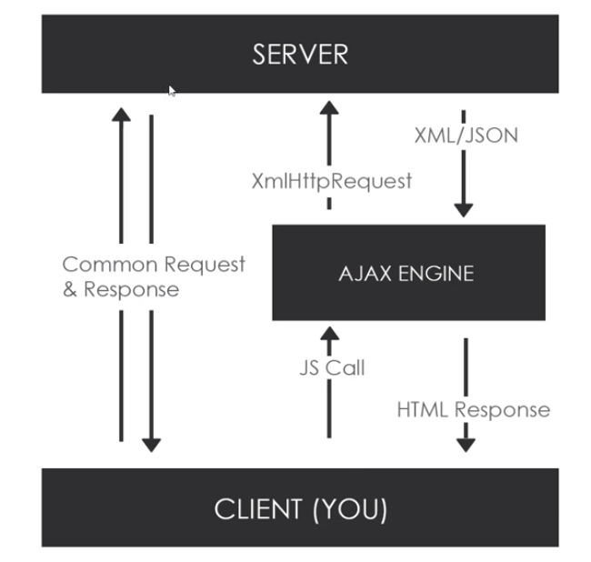

# Network

<h3>Networking between Server and Client</h3>

<h4>AJAX(Asynchronous JavaScript and XML)</h4>

<ul>
  <li>Set of web technologies</li>
  <li>Send and receive data Asynchronously</li>
  <li>Does not interface with current web page</li>
  <li>JSON has replaced XML for the most part</li>
  <li>Send common request and get response</li>
  <li>Send data with JSON or plain text</li>
</ul>
 

 

<h4>XmlHttpRequest Object</h4>

<ul>
  <li>API in the form of an object</li>
  <li>Provided by tje browser's JS environment</li>
  <li>Methods transfer data between client / server</li>
  <li>Can be used with other protocols than HTTP</li>
  <li>Can work with the data other than XML(JSON, plain text)</li>
  <li>Send data with JSON or plain text</li>
</ul>
 

 

<h3>JSON</h3>

<h4>JSON(Javascript Object Notation)</h4>

<ul>
  <li>LightWeight data-interchange format</li>
  <li>Based on a subset of Javascript</li>
  <li>Easy to read and write</li>
  <li>Often used with AJAX</li>
  <li>Can be used with most modern languages</li>
</ul>
 

<h4>DataType</h4>

<ul>
  <li>number</li>
  <li>string</li>
  <li>boolean/li>
  <li>array</li>
  <li>object</li>
</ul>
 

<h4>JSON Syntax Rules</h4>

<ul>
  <li>Uses key/value pairs= {“name” : “Brad”}</li>
  <li>Uses double quotes around Key and value</li>
  <li>Must use the specified data types</li>
  <li>File type is “.json”</li>
  <li>MIME type is “Application/json”</li>
</ul>
 

<h4>JSON Ex</h4>

<code><pre>
{
    "postId": 1,
    "id": 1,
    "name": "id labore ex et quam laborum",
    "email": "Eliseo@gardner.biz",
    "body": "laudantium enim quasi est quidem magnam voluptate ipsam eos\ntempora quo necessitatibus\ndolor quam autem              quasi\nreiciendis et nam sapiente accusantium"
  },

</pre></code>

